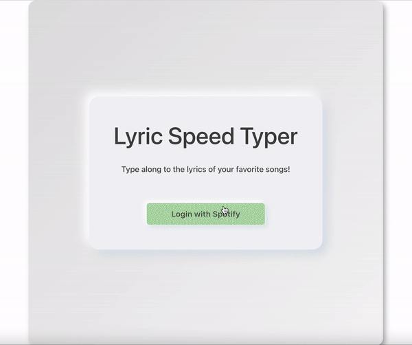

# Spotify Lyric Typing Test - Web App

##### Improve your typing skills by typing along to the lyrics of your favorite spotify songs as they play! This personal project was developed to create a more engaging and fun way to practice typing speed and accuracy. Please see the demo gif below and [the backend here](https://github.com/AaronFlore/Lyric-Speed-Typer-Backend "the backend repo here"): 

## Tech Stack
### Frontend: React, JavaScript, HTML, CSS  Backend: Node.js, Express, Spotify Web API
## What I Learned: 
##### • Authroizing user access with the Spotify Web API via the Express framework and spotify-web-api-node library.  • Having the backend server refresh the user's spotify access token before expiring for uninterrupted app access.  • Building a UI with React Bootstrap and integrating the Spotify API and relevant libraries into that UI  • Deploying and hosting a full stack app online with Render
#### Please note the online web app can only be accessed by request due to Spotify not allowing their API to be used publicly for apps considered "games".
